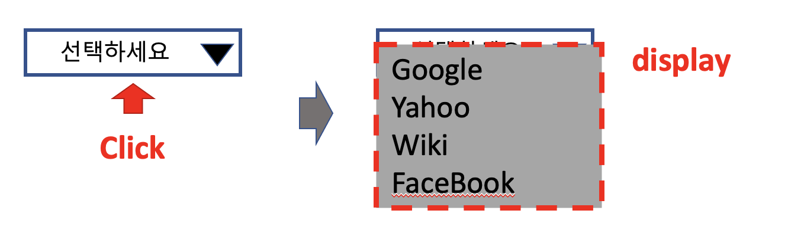
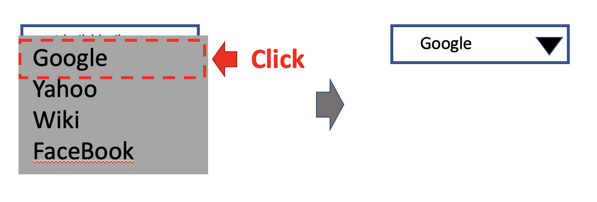
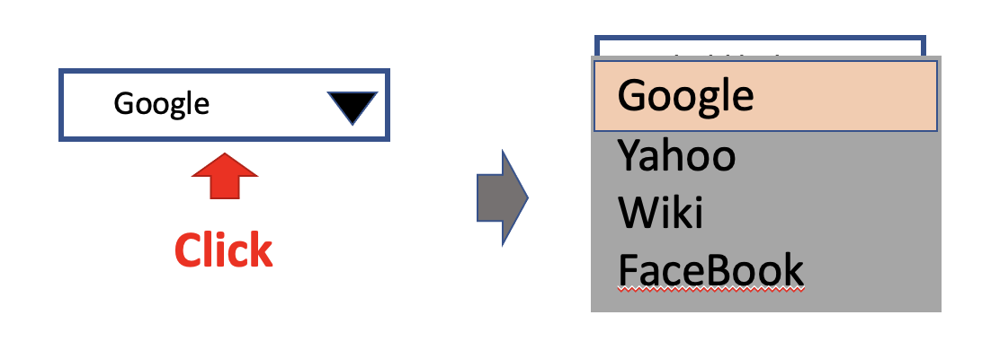
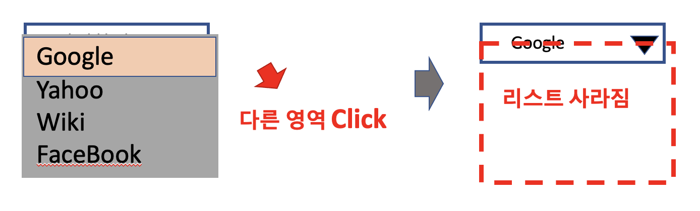

# DropDown List Component

## 요구사항

### 1. 라벨 클릭 시 선택 가능한 list가 출력된다.

### 2. dropdown item을 선택 시 선택된 데이터를 라벨에 출력한다.

### 3. dropdown item을 선택 시 선택된 데이터를 외부로 전달할 수 있도록 한다.

### 4. dropdown item을 선택 시 선택된 데이터에 선택 여부를 표시한다.

### 5. dropdown 외에 영역 클릭 시 아무런 이벤트 없이 리스트를 닫는다.

### 6. 디자인 템플릿을 변경할 수 있도록 템플릿을 분리한다.

