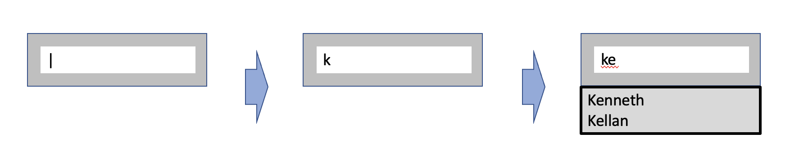
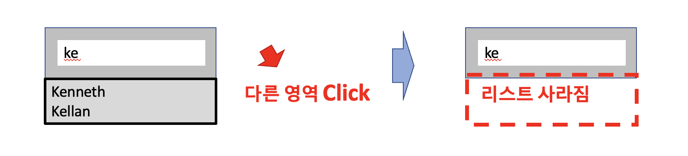
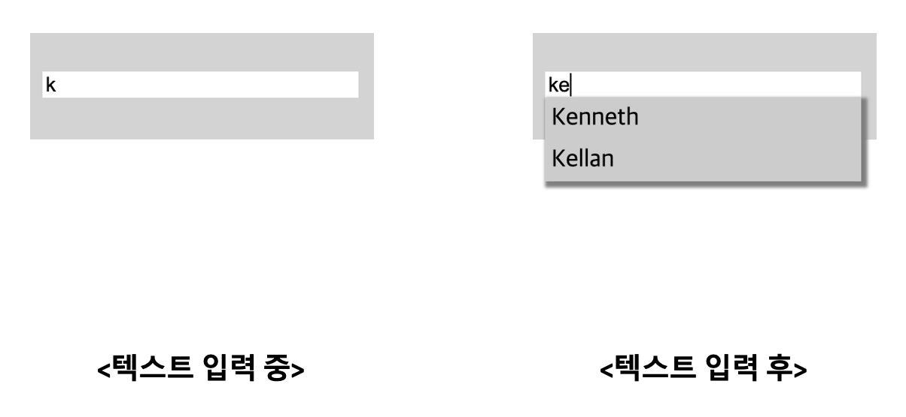

## Case12 : Auto Complete 2

### 케이스 주제

Q. 검색어를 입력하는 동시에 DB에 저장되어 있는 유관 검색어를 실시간으로 출력하는 기능을 구현하십시오.


### 기능 요구사항

1. 키보드 이벤트를 지연시간(debounce 기능)을 통해 request 횟수를 줄인다.



2. 검색 필드를 벗어나면 출력된 리스트는 사라진다.



### 기능 작동 이미지



### 문제
- q1. 검색결과 리스트를 text input 하단에 출력하시오.

- q2. debounce 기능을 구현하시오.

- q3. debounce 기능을 통해 request 호출을 최소화 하시오.

- q4. 검색 필드 외에 다른 곳을 클릭할 때 출력된 리스트를 보이지 않도록 하시오.


### 주요 학습 키워드
- input event의 활용도
- selector.getBoundingClientRect() 함수
- 지연시간을 적용하여 마지막 이벤트만 발생시키는 기능 (debounce)


### 작성해주셔야 하는 question 파일경로
**q1**
`./src/question/auto-complete/index.js`
line : 90

**q2**
`./src/question/auto-complete/util/index.js`

**q3**
`./src/question/auto-complete/index.js`
line : 104

**q4**
`./src/question/auto-complete/index.js`
line : 115


### 실행 방법 및 의존성 모듈 설치
경로
`./` (root directory)

터미널
```bash
  $ npm install
  $ npm run dev
```

