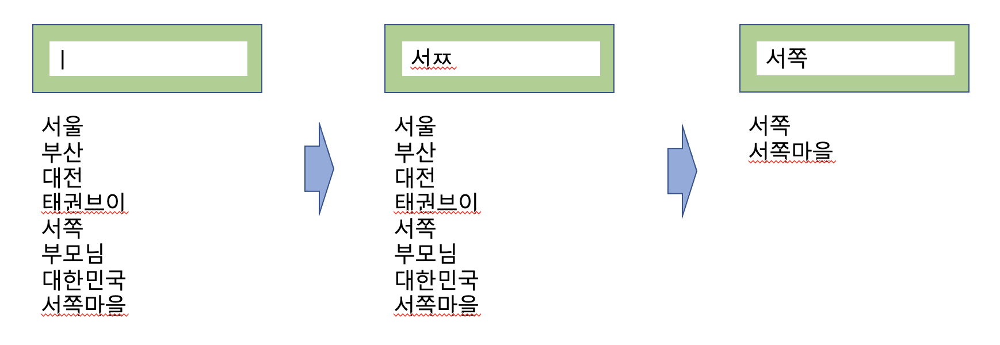
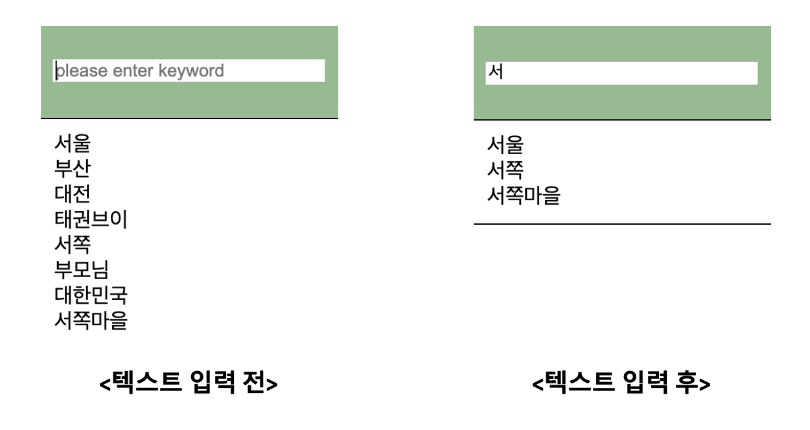

## Case13 : Instant Search


### 케이스 주제

Q. 검색어를 입력하는 동시에 엔터키, 검색 버튼 누를 필요 없이 결과값을 즉시 반영할 수 있는 순간 검색 기능을 구현하십시오.


### 기능 요구사항

1. 키보드 이벤트를 지연시간(debounce 기능)을 통해 request 횟수를 줄인다.



2. 디자인 템플릿을 변경할 수 있도록 템플릿을 분리한다.


### 기능 작동 이미지



### 문제
- q1. configuration을 참고하여 input element를 생성하시오. (기능과 디자인을 분리하기 위한 방법, src->question->instant-search->index.js)

- q2. debounce 기능을 구현하시오. (src->question->instant-search->util->index.js)

- q3. debounce 기능을 통해 가져온 데이터를 외부로 전달한다. (src->question->instant-search->index.js)

- q4. Promise를 사용하여 검색 키워드에 맞는 데이터를 가져와 리스트를 출력하시오. (src->question->instant-search->mock->word->index.js / src->index.js)


### 주요 학습 키워드
- 지연시간을 적용하여 마지막 이벤트만 발생시키는 기능 (debounce) 
- request api를 대신하기 위한 Promise 활용 (test를 위한 mock data 활용)
- 디자인 부분과 기능을 분리하기 위한 방법


### 작성해주셔야 하는 question 파일경로

**q1**
`./src/question/instant-search/index.js`
line : 43

**q2**
`./src/question/instant-search/util/index.js`

**q3**
`./src/question/instant-search/index.js`
line : 53

**q4**
`./src/question/instant-search/mock/word/index.js`
line : 30

`./src/index.js`
line : 35


### 실행 방법 및 의존성 모듈 설치

경로
`./` (root directory)

터미널

```bash
  $ npm install
  $ npm run dev
```

