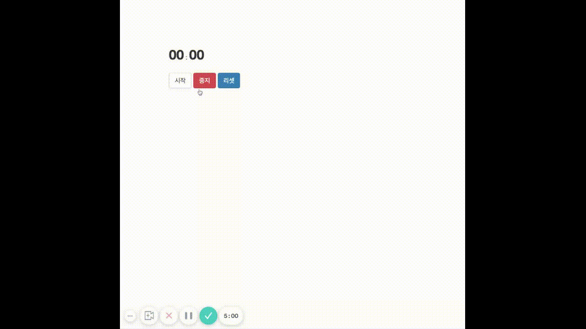

## Case14 : Stop watch

### 케이스 주제
Q. 타이머(스톱워치) 구현


### 기능 요구사항
1. 타이머 뷰를 구현하고 시작 / 중지 / 리셋에 따라 타이머가 동작하도록 한다.


### 기능 작동 이미지



### 문제
q1. Javascript - 주어진 템플릿(`index.html`)의 요소에 페이지에 맞는 요소를 표현하는 문제
 1) isPending 이 false 일때만 setTimeout 을 재귀 호출하는 것을 만드세요.
 2) reset 버튼을 누를 시 화면과 시간을 00:00:00으로 초기화되게 만드세요.
 3) 타이머를 시작하는 부분을 만드세요.

q2. Jquery - Javascript로 구현한 기능을 동일하게 Jquery로도 구현해보는 문제

q3. React - 주어진 코드를 이해하고, 상태를 조작하는 이벤트핸들러와 라이프사이클 훅을 활용하는 문제
 1) setInterval 또는 setTimeout 으로 반복시키는 부분을 완성해주세요.
 2) 60초가 될때를 감지하는 부분을 완성한다.


### 주요 학습 키워드
- 데이터 모델 -> 뷰 방향의 단방향 데이터 바인딩 구현


### 작성해주셔야 하는 question 파일경로
**q1**
`./question/q1_js/index.js`

**q2**
`./question/q2_jquery/index.js`

**q3**
`./question/q3_react/src/App.js`


### 실행 방법 및 의존성 모듈 설치
**q1**
경로
`./question/q1_js`
index.html 열기

**q2**
경로
`./question/q2_jquery`
index.html 열기

**q3**
경로
`./question/q3_react`

터미널
```bash
  $ npm install
  $ npm start
```