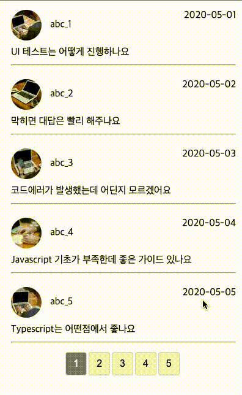

## Case18 : Pagination

### 케이스 주제
Q. 페이지네이션 구현

### 기능 요구사항
1. 주어진 댓글 데이터 22개에 대해 페이지를 나눠 댓글 요소를 뷰에 표현한다.
2. 페이지 당 표현할 수 있는 댓글 요소 수를 설정할 수 있다.
3. 현재 페이지를 알 수 있고, 다음 페이지로 넘어갈 수 있는 뷰에 기능을 구현한다.


### 기능 작동 이미지
   


### 실행 방법 / 풀이 방법 안내
> 문제 풀기 방식 :
>
> 1. 레포지토리를 clone
> 2. question 디렉토리에 `package.json`이 없는 경우, `index.html`을 열거나, live-server extension으로 열기. 이외 경우 아래 안내 참고.
> 3. 터미널에서 각 문제 폴더 디렉토리로 이동하여 `npm install`로 의존성을 설치
> 4. `package.json`을 참고하여, 명시된 scripts 명령어로 개발서버 실행.
> 5. 코드 수정하면서 문제 해결하세요

기본 번들러로 `parcel`을 사용했습니다. - `react` 문제의 경우, `react-scripts` 사용. 문제 디렉토리에서 `npm start` 또는 `npx parcel index.html watch`로 개발서버를 실행하세요.


### 문제
q1. JavaScript로 해당 기능을 구현하세요. (* index.js 파일 확인)
- 페이지 번호를 동적으로 생성했을 때, 이벤트를 할당하기
- 페이지네이션 페이지번호를 주었을 때, 나오는 게시물수 컨트롤하기
- 활성화 된 버튼 처리하기

q2. jQuery 해당 기능을 구현하세요. (* index.js 파일 확인)
- jQuery 문서로드 처리하기
- jQuery로 동적으로 엘리멘트 생성시, 이벤트를 할당하는 방법

q3. React로 해당 기능을 구현하세요. (* comment.js 파일 확인)
- 각 클릭 시 react로 상태를 어떻게 처리하는지
- redux toolkit을 사용


### 주요 학습 키워드
- 페이지 설정에 따른 댓글 데이터 가공 표현


### 작성해주셔야 하는 question 파일경로
**q1**
`./question/q1_js/index.js`

**q2**
`./question/q2_jquery/index.js`

**q3**
`./question/q3_react_redux/src/containers/CommentListContainer.js`
`./question/q3_react_redux/src/containers/PageListContainer.js`


### 실행 방법 및 의존성 모듈 설치
**q1**
경로
`./question/q1_js`
index.html 열기

**q2**
경로
`./question/q2_jquery`
index.html 열기

**q3**
경로
`./question/q3_react_redux`

터미널
```bash
  $ npm install
  $ npm start
```