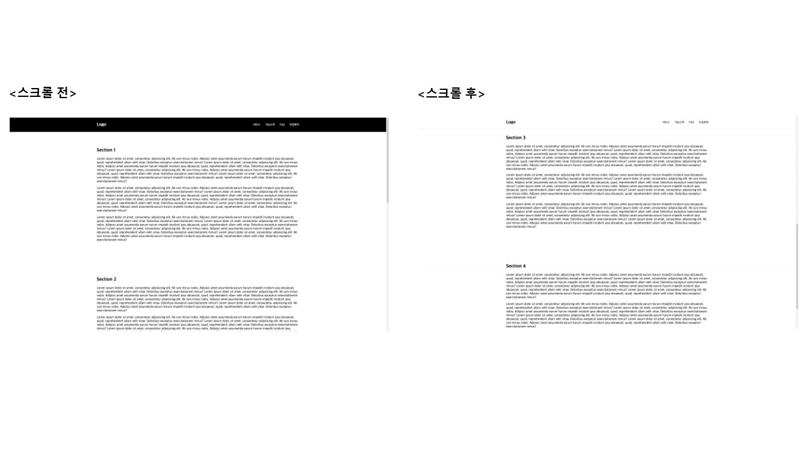

## Case19 : Scroll top

### 케이스 주제
Q. 스크롤을 내렸을 경우 상단에 고정된 내비게이션바의 배경과 폰트 색상이 변경되는 기능을 구현하세요.

### 기능 요구사항
1. 스크롤을 내릴 경우 내비게이션 배경 색상과 폰트 색상이 변경됩니다.
2. 스크롤을 다시 올릴 경우 변경된 상태를 유지하다가 더 이상 올릴 수 없을 때(최상단에 스크롤이 위치할 때) 이전 상태로 돌아가게 됩니다.
3. 스크롤을 다시 올릴 경우 곧바로 배경/폰트 색상을 이전 상태로 변경하는 방식으로도 구현해봅니다.

### 기능 작동 이미지

### 문제
q1. javaScript - 스크롤을 다시 올릴 경우 변경된 상태를 유지하다가 더 이상 올릴 수 없을 때(최상단에 스크롤이 위치할 때) 이전 상태로 변경
1) 현재 스크롤 위치를 가져온다
2) 스크롤 위치를 바탕으로 active 클래스를 추가하거나 제거한다

q2. javaScript - 스크롤을 다시 올릴 경우 곧바로 배경/폰트 색상을 이전 상태로 변경
1) 현재 스크롤 위치를 가져온다.
2) oldvalue, 스크롤의 위치와 연산 작업을 하여 active 클래스를 추가하거나 제거한다.
3) oldvalue를 스크롤 위치로 변경한다.

q3. javaScript - 자바스크립트에서 제공하는 마우수 휠 이벤트 동작 감지 기능을 사용해서 구현
1) 마우스 휠 이벤트 동작을 감지하여 동작시킨다
2) *참고 : 자바스크립트에서는 마우스 휠 방향을 알 수 있는 mousewheel, wheel, DOMMouseScroll 이벤트를 제공합니다.

q4. jQuery - 스크롤을 다시 올릴 경우 변경된 상태를 유지하다가 더 이상 올릴 수 없을 때(최상단에 스크롤이 위치할 때) 이전 상태로 변경
1) 현재 스크롤 위치를 가져온다.
2) 스크롤 위치를 바탕으로 active 클래스를 추가하거나 제거한다.

q5. jQuery - 스크롤을 다시 올릴 경우 곧바로 배경/폰트 색상을 이전 상태로 변경

### 주요 학습 키워드
- 크로스 브라우징을 고려하여 스크롤 위치를 가져오는 방법을 학습하게 됩니다.

### 작성해주셔야 하는 question 파일경로
**q1**
`./Question/q1_js_1/main.js`

**q2**
`./Question/q2_js_2/main.js`

**q3**
`./Question/q3_js_3/main.js`

**q4**
`./Question/q4_jq_1/main.js`

**q5**
`./Question/q5_jq_2/main.js`

### 실행 방법 및 의존성 모듈 설치
**q1**
경로
`./question/q1_js_1`
index.html 열기

**q2**
경로
`./question/q2_js_2`
index.html 열기

**q3**
경로
`./question/q3_js_3`
index.html 열기

**q4**
경로
`./question/q4_jq_1`
index.html 열기

**q5**
경로
`./question/q5_jq_2`
index.html 열기