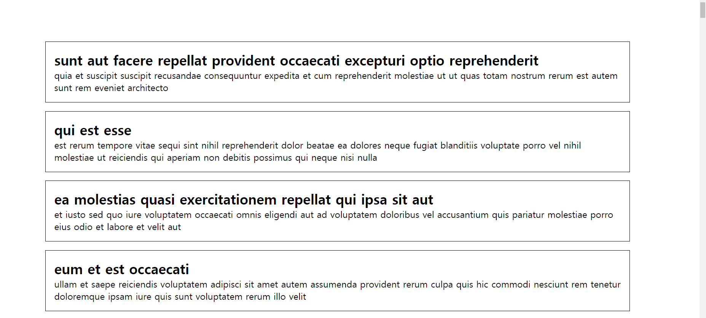

## Case20 : List

### 케이스 주제
Q. 서버 통신으로 가져온 Post 정보를 화면에 리스트 방식으로 적용하세요.

### 기능 요구사항
- GET 방식으로 Post 정보를 가져옵니다.
- 가져온 정보를 순차적으로 화면에 적용시킵니다.

### 기능 작동 이미지
##### <적용 전>
(빈 화면)

##### <적용 후>

### 문제
q1. javaScript
1) fetch 함수를 사용하여 해당 기능을 구현하세요.
2) Fetch Refactoring : 콜백함수를 사용하여 통신 영역, 템플릿 영역을 분할하여 작성하시오

q2. javaScript
1) axios 라이브러리를 사용하여 해당 기능을 구현하세요.
2) Axios Refactoring

q3. javaScript - async/await와 콜백 함수를 사용하여 해당 기능을 구현하세요.

q4. jQuery로 해당 기능을 구현하세요.

### 주요 학습 키워드
- Fetch, Axios, Ajax 기본 사용법과 함께 async / await를 사용한 비동기 방식과 함께 역할별로 코드를 리팩토링 하는 방법을 익히게 됩니다.

### 작성해주셔야 하는 question 파일경로
**q1**
`./question/1. js-fetch/main.js`

**q2**
`./question/2. js-axios/main.js`

**q3**
`./question/3. js-async-await/main.js`

**q4**
`./question/4. jq/main.js`

### 실행 방법 및 의존성 모듈 설치
**q1**
경로
`./question/1. js-fetch`
index.html 열기

**q2**
경로
`./question/2. js-axios`
index.html 열기

**q3**
경로
`./question/3. js-async-await`
index.html 열기

**q4**
경로
`./question/4. jq`
index.html 열기

