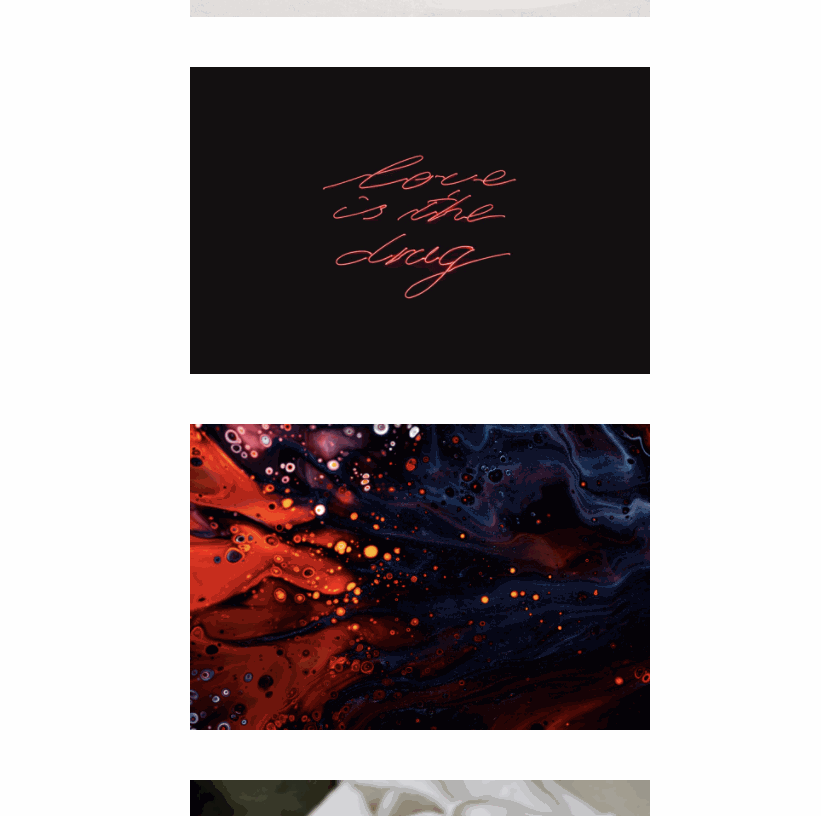

## Case 21 : Modal Window 2

### 케이스 주제
Q. 이미지를 클릭하면 그 이미지 정보를 담고 있는 모달창이 등장하고, 레이어를 클릭하면 모달창이 사라지는 기능을 만드세요.

### 기능 요구사항
- Unsplash의 List photo API를 사용해서 이미지 정보를 리스트로 화면에 띄우고,
- 특정 이미지를 클릭했을 때, 그 이미지에 대한 설명이 기재된 모달창을 띄우세요.
- 이미지에 대한 설명은 해당 이미지의 데이터 속성 값으로 리스트 안에 미리 넣어두는 형태로 처리하시오.
- 모달창을 제외한 외부 여백 공간 클릭 시 모달창이 사라지도록 하세요.

### 기능 작동 이미지

### 문제
- JavaScript로 해당 기능을 구현하시오.

### 주요 학습 키워드
- 객체 형태로 데이터 속성값이 정보를 저장하여 이를 가져오는 방법을 학습합니다.
- 레이어 팝업을 처리하는 방법을 익히게 됩니다.

### 작성해주셔야 하는 question 파일경로
**q1**
`./question/1.js/main.js`

### 실행 방법
**q1**
경로
`./question/1.js`
index.html 실행