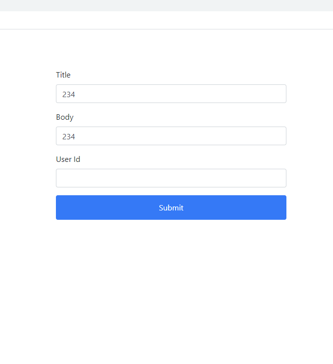

## Case 23 : Loading

### 케이스 주제
Q. 요구사항 : 회원가입, 로그인, 게시물 작성 등 서버에 데이터를 보낼 경우 전송중인 상태를 화면에 표기합니다.

### 기능 요구사항
- 서버에 데이터를 보내는 경우, 데이터를 전송중인 상태를 나타내기 위해 화면에 스피너 UI를 띄우세요.
- 통신이 완료되었을 시, 완료된 상태를 나타내는 Alert 창을 띄우세요.

### 기능 작동 이미지

### 문제
- JavaScript로 해당 기능을 구현하시오.

### 주요 학습 키워드
- 각 역할별로 콜백함수를 생성하여 코드를 관리하는 방법을 익히고, 통신 성공 / 실패를 효율적으로 관리하는 방법을 익히게 됩니다.

### 작성해주셔야 하는 question 파일경로
**q1**
`./question/1.js/main.js`

### 실행 방법 및 의존성 모듈 설치
**q1**
경로
`./question/1.js`
index.html 열기