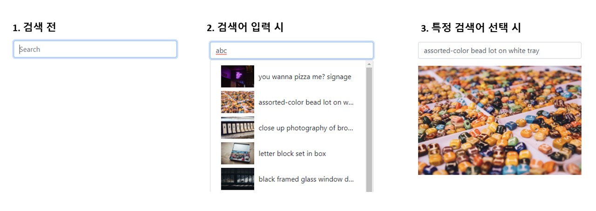

## Case24 : Search bar
Q. 검색 리스트를 드랍다운 메뉴로 표기하고, 메뉴를 선택하면 선택한 이미지를 화면에 표기합니다.


### 기능 요구사항
1. 이미지 API : https://unsplash.com/documentation#search-photos
2. debounce : https://lodash.com/docs/4.17.15#debounce


### 기능 작동 이미지



### 문제
q1. 문제 상황에 대하여 javaScript로 동작을 구현시킬 수 있는 코드를 작성해보세요
1. 검색 이미지 리스트 가져오기
2. 하나의 이미지 정보만 가져오기
3. 검색 드랍다운 표기
4. 검색 드랍다운 리스트 표기
5. 선택한 이미지 정보 표기

q2. 문제 상황에 대하여 jQuery로 동작을 구현시킬 수 있는 코드를 작성해보세요
1. JavaScript로 짠 코드를 jQuery로 전환
2. Data 속성 활용


### 주요 학습 키워드
- 검색어 입력에 따른 API 호출을 제어하는 방법을 학습하게 됩니다.
- axios 라이브러리와 async, await를 이용한 API호출
- lodash 라이브러리의 debounce()를 사용하여 불필요한 호출 줄이기
- 반복문을 통해 createElement, innerHTML, appendChild를 사용하여 리스트 표기
- jQuery의 data- 속성 활용


### 작성해주셔야 하는 question 파일경로
**q1**
`./question/1.js/main.js`

**q2**
`./question/2.jq/main.js`


### 실행 방법 및 의존성 모듈 설치
**q1**
경로
`./question/1.js`
index.html 열기

**q2**
경로
`./question/2.jq`

터미널
```bash
  $ npm install
  $ npm start
```