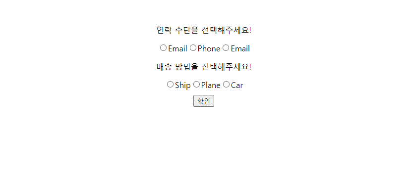

## Case26 : Radio Box

### 케이스 주제
라디오 박스는 여러 값들이 주어지고 그 중에서 단 하나를 선택할 수 있는 UI 입니다. 

기본적으로 type이 radio인 input tag를 사용해 만들며, 브라우저가 type이 radio인 input들 중 name 속성이 같은 것들은 하나만 선택되도록 강제하고 그에 따라 렌더링 합니다. 

이 라디오 박스는 이렇게 input tag를 사용해도 되지만 다른 tag를 사용해 커스텀하게 작성할 수도 있습니다. 다만 이 경우엔 하나만 선택되고 그에 따라 렌더링이 될 수 있도록 추가적인 작업을 JavaScript로 해주어야 합니다.

- Q. 아래와 같은 스펙을 가진 라디오 박스를 만들어보세요.

### 기능 요구사항
- 하나의 form tag를 만든다.
- 이 form tag 안에 연락 수단과 배송 수단을 선택할 수 있는 라디오 박스 UI를 최소 두개를 만든다.
- form을 제출하면(type이 submit인 버튼을 누르면) 모든 수단이 선택되었는지 검사한다.
- 항목 하나라도 선택하지 않았으면 모든 항목에 대한 선택을 해야한다는 정보성 vUI를 만들어 보여준다.
- 검사를 무사히 통과했으면 현재 form이 최종적으로 어떤 데이터를 보내려는지 form UI 하단에 보여준다.

### 기능 작동 이미지

### 문제
q1. Javascript로 위 기능을 구현하시오.

### 주요 학습 키워드
- submit event가 발생하면 formData를 이용해 value를 가져오고 배열로 만들어주기
- Object.key를 사용하여 폼을 모두 작성했는지 체크하기
- 입력한 정보를 innerHTML을 사용하여 DOM에 동적으로 추가하기

### 작성해주셔야 하는 question 파일경로
**q1**
`./question/index.js`

### 실행 방법
**q1**
경로
`./question`
index.html 열기