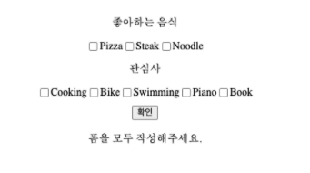
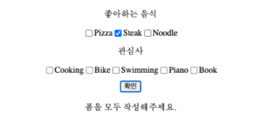
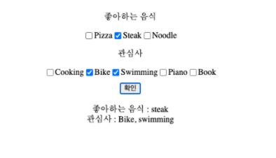

## Case27 : Check box


### 케이스 주제
Q. 아래와 같이 작동하는 체크 박스를 구현하시오.
> 체크 박스는 여러 값들이 주어지고 그 중에서 여러 값을 선택할 수 있는 UI 입니다. 
> 기본적으로 type이 checkbox인 input tag를 사용해 만들며 이 체크 박스는 이렇게 input tag를 사용해도 되지만 
> 다른 tag를 사용해 커스텀하게 작성할 수도 있습니다. 
> 여러개를 선택할 수 있고 그에 따라 여러 체크 박스들이 제대로 렌더링이 될 수 있도록 추가적인 작업을 JavaScript로 해주어야 합니다.


### 기능 요구사항
요구 사항은 아래와 같다.

1. 하나의 form tag를 만든다.
2. 이 form tag 안에 좋아하는 음식과 관심사를 여러개 선택할 수 있는 체크 박스 UI를 최소 두개를 만든다.
3. form을 제출하면(type이 submit인 버튼을 누르면) 좋아하는 음식과 관심사가 각각 최소 하나씩 선택되었는지 검사한다.
   최소 하나씩 선택하지 않았으면 선택을 해야한다는 정보성 UI를 만들어 보여준다.
4. 검사를 무사히 통과했으면 현재 form이 최종적으로 어떤 데이터를 보내려는지 form UI 하단에 보여준다.

**첫 화면**


**아무것도 선택하지 않고 submit 했을때**


**항목 중 하나만 선택했을때**


**각 항목당 최소 하나 이상 선택했을때**



### 주요 학습 키워드
- submit event가 발생하면 formData를 이용해 value를 가져오고 배열로 만들어주기
- filter 함수를 사용하여 length 체크하기
- 입력한 정보를 innerHTML을 사용하여 DOM에 동적으로 추가하기


### 작성해주셔야 하는 question 파일경로
`./question/app.js`


### 실행 방법 및 의존성 모듈 설치
경로
`./question`

터미널
```bash
  $ yarn install
  $ yarn start
```