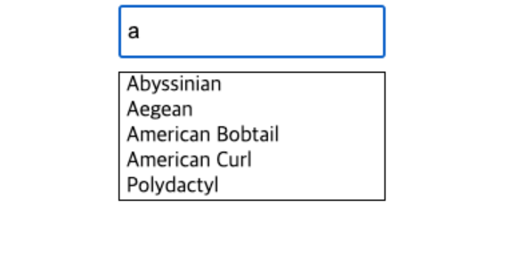

## Case29 : Instant search
### 케이스 주제

Q. 아래와 같이 작동하는 즉시 검색 기능을 구현하시오.

### 기능 요구사항

요구 사항은 아래와 같다.

1. 하나의 input tag를 만든다.
2. 이 input에 키보드 타이핑이 될때 현재 검색어 기준으로 필요한 API를 호출한다.
   이때 API 호출은 즉각 실행해서 결과를 보여준다.
3. 검색어 API가 진행 중일때 input tag 우측에 loading 중임을 표시한다.
4. 검색어 API Response가 도착하면 그 내용을 input tag 아래에 리스트로 보여준다.

**첫화면**


**검색어를 입력하고 로딩 중일때**


**검색어 API의 Response가 도착했을때**


**해당하는 검색어가 없을때**


### 주요 학습 키워드
- fetch와 async, await를 이용한 API호출
- slice, map 함수를 사용하여 특정조건에 맞는 검색어를 특정갯수만큼 노출 시키는 기능 구현
- Element 속성 innerHTML, style을 사용하여 DOM에 보여주기 


### 작성해주셔야 하는 question 파일경로
`./question/src/app.js`


### 실행 방법 및 의존성 모듈 설치
경로
`./question`

터미널
```bash
  $ yarn install
  $ yarn start
```