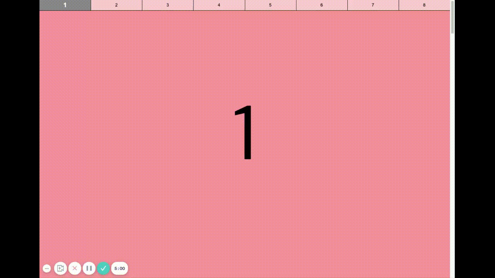

## Case2 : Scroll spy


### 케이스 주제
Q. 스크롤스파이 구현하기


### 기능 요구사항
1. 최초 화면: 상단메뉴의 ‘1’이 활성화되어 있음.
2. 스크롤을 내리면서 나오는 숫자가 상단 메뉴에 활성화된 숫자와 일치하도록 합니다.
3. 상단 메뉴를 클릭하여, 해당 숫자가 적힌 스크롤위치로 이동할 수 있습니다.


### 기능 작동 이미지



### 실행 방법 / 풀이 방법 안내
> 문제 풀기 방식 :
>
> 1. 레포지토리를 clone
> 2. 터미널에서 각 문제 폴더 디렉토리로 이동하여 `npm install`로 의존성을 설치
> 3. `package.json`을 참고하여, 명시된 scripts 명령어로 개발서버 실행.
> 4. 코드 수정하면서 문제 해결하세요

기본 번들러로 `parcel`을 사용했습니다. - `react` 문제의 경우, `react-scripts` 사용. 문제 디렉토리에서 `npm start` 또는 `npx parcel index.html watch`로 개발서버를 실행하세요.


### 문제
q1. offsetTop, scrollTop, clientHeight의 상관관계를 통해 해당 기능을 구현하시오.

q2. resize에 무관하게 동작하게끔 기능을 구현하시오.

q3. resize listener를 적용하여 동작을 구현하시오.

q4. throttle과 debounce를 통해 해당 동작을 구현하시오.

q5. Intersection Observer를 활용하여 기능을 구현하시오.

q6. Intersection Observer를 활용하여 React로 해당 기능을 구현하시오.


### 주요 학습 키워드
- 스크롤 동작 감지
- offsetTop/scrollTop/clientHeight의 상관관계
- 이벤트 리스너, mousewheel, throttle과 debounce, IntersectionObserver, 
- useEffect


### 작성해주셔야 하는 question 파일경로
**q1**
`./question/q1_js_1/index.js`

**q2**
`./question/q2_js_2/index.js`

**q3**
`./question/q3_js_resize_listener/index.js`

**q4**
`./question/q4_js_throttle/util.js`

**q5**
`./question/q5_js_Intersection_Observer/index.js`

**q6**
`./question/q6_react_Intersaction_Observer/src/App.js`


### 실행 방법 및 의존성 모듈 설치
**q1**
경로
`./question/q1_js_1`

터미널
```bash
  $ npm install
  $ npm start
```


**q2**
경로
`./question/q2_js_2`

터미널
```bash
  $ npm install
  $ npm start
```

**q3**
경로
`./question/q3_js_resize_listener`

터미널
```bash
  $ npm install
  $ npm start
```

**q4**
경로
`./question/q4_js_throttle`

터미널
```bash
  $ npm install
  $ npm start
```

**q5**
경로
`./question/q5_js_Intersection_Observer`

터미널
```bash
  $ npm install
  $ npm start
```

**q6**
경로
`./question/q6_react_Intersaction_Observer`

터미널
```bash
  $ npm install
  $ npm start
```