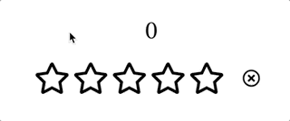

## Case30 : Rating UI


### 케이스 주제
별점을 평가할 수 있는 Rating UI를 구현하세요.

Q. 아래와 같은 스펙을 가진 Rating UI를 구현하세요.


### 기능 요구사항
1. 0 ~ N 개의 별을 표시합니다. (0.5점 단위)
2. 각 별은 비어있거나(Empty), 반만 차있거나(Half), 꽉 차있을 수 있습니다(Full). (3가지 각 이미지 파일은 assets 폴더 안에 있습니다.)
3. 별 위로 마우스오버하면 왼쪽부터 마우스 위치까지의 채워진 별로 표시합니다.
4. 클릭시 점수 상태를 업데이트합니다.
5. X 버튼을 클릭하면 별점을 0점으로 초기화합니다.

- 별의 갯수가 N값만 조정하면 쉽게 변경되도록 작성해보세요.


### 기능 작동 이미지



### 문제
q1. N점 만점의 Rating UI를 JavaScript(ES6+)로 구현해보세요.

q2. N점 만점의 Rating UI를 React Component로 구현해보세요.


### 주요 학습 키워드
- DOM Access, DOM Events(mousemove, mouseleave, click, etc.), MouseEvent, Mouse Position Calculation, useState, State Management


### 작성해주셔야 하는 question 파일경로

**q1**
`./question/q1/index.js`

**q2**
`./question/q2/src/components/StarRate.jsx`
*출제자 강사님 코드 기반으로, 해당 경로에서 요구한 문제사항을 해결해주세요*


### 실행 방법 및 의존성 모듈 설치
**q1**
경로
`./question/q1`

터미널

```bash
  $ npm install
  $ npm start
```
빌드가 완료되면 [localhost:3001](http://localhost:3001)로 접속합니다.

**q2**
경로
`./question/q2`

터미널
```bash
  $ npm i
  $ npm run start
```
빌드가 완료되면 [localhost:3002](http://localhost:3002)로 접속합니다.

