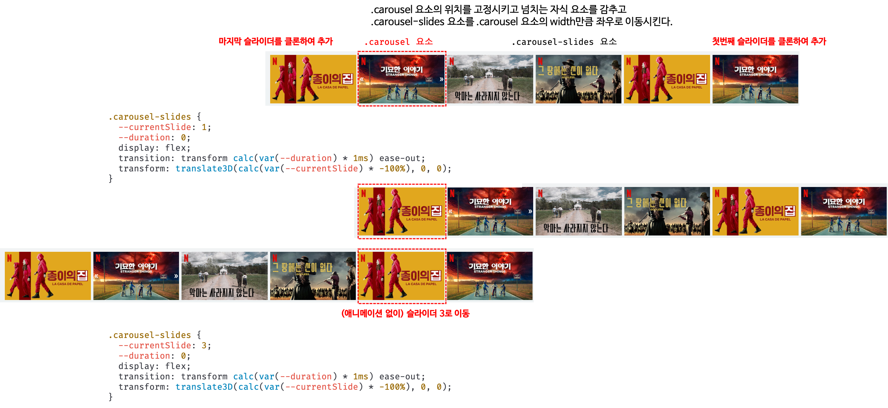

## Case8 : Carousel


### 케이스 주제
Q. 아래와 같이 작동하는 케러셀을 구현하시오.
> 캐러셀(Carousel)은 컨텐츠를 슬라이드 형태로 순환하며 표시하는 UI를 말한다. [캐러셀은 비생산적인 디자인 패턴](https://brunch.co.kr/@ebprux/41)이라는 주장이 있기도 하지만 사용자가 스크롤을 내리지 않은 상태에서도 많은 정보를 노출할 수 있는 장점이 있어 많은 웹사이트에서 사용하고 있다.


### 기능 요구사항
요구 사항은 아래와 같다.

1. 무한 루핑 기능을 지원한다.
2. 슬라이딩 애니메이션을 지원한다.
3. 각 슬라이드의 width/height는 가변적이다. 단, 모든 슬라이드의 width/height는 동일하다.
4. 슬라이드 이동 버튼을 연타해도 이상없이 동작해야 한다.
5. 캐러셀 슬라이더를 표시할 HTML 요소와 슬라이드 이미지의 url로 구성된 배열을 전달하면 동적으로 캐러셀 슬라이더를 생성한다.

- 캐러셀 슬라이더 알고리즘
  - 정상적으로 한칸씩 이동하는 경우
  
  - 슬라이더의 선두 또는 가장 뒤에서 이동하는 경우
  


#### React
1. 함수 컴포넌트와 훅을 사용해 구현한다.
2. 스타일은 CSS, Sass, CSS Module, styled-components 중 어느 것을 사용해도 좋으나 가급적 styled-components 사용을 권장한다.


### 주요 학습 키워드
- [CSS 변수(CSS 커스텀 프로퍼티)](https://developer.mozilla.org/ko/docs/Web/CSS/Using_CSS_custom_properties)
- [HTMLElement.offsetWidth](https://developer.mozilla.org/en-US/docs/Web/API/HTMLElement/offsetWidth)
- [HTMLElement: transitionend event](https://developer.mozilla.org/en-US/docs/Web/API/HTMLElement/transitionend_event)
- [styled-components](https://styled-components.com/)
- [useState](https://ko.reactjs.org/docs/hooks-state.html)


### 작성해주셔야 하는 question 파일경로
**q1_js**
`./question/q1_js/src/app.js`

**q2_react**
`./question/q2_react/src/App.js`

### 실행 방법 및 의존성 모듈 설치
**q1**
경로
`./question/q1_js`
index.html 열기

**q2**
경로
`./question/q2_react`

터미널
```bash
  $ yarn install
  $ yarn start
```