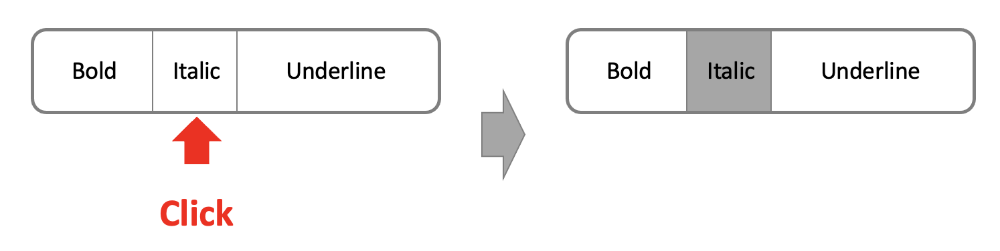
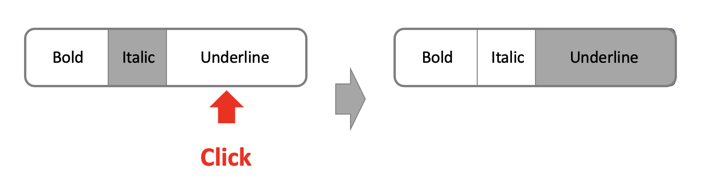
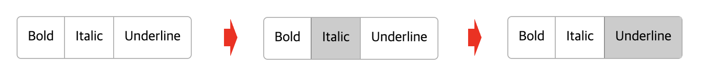

## Case9 : Toggle button


### 케이스 주제
Q. on, off 기능 (toggle 기능)을 가지는 버튼 리스트 컴포넌트를 구현하십시오.


### 기능 요구사항
1. 각 버튼이 선택이 되었는지 안되었는지를 확인할 수 있다.



2. 여러개의 버튼 중 하나의 버튼만 toggle 할 수 있다.



### 기능 작동 이미지



### 문제
- q1. 데이터에 따른 버튼리스트를 가로로 출력하시오.

- q2. 한개의 버튼만이 on이 될 수 있도록 하시오.

- q3. 선택된 버튼의 index를 application으로 전달 하시오.


### 주요 학습 키워드
- 버튼 스타일 적용
- 컴포넌트와 어플리케이션과의 통신


### 작성해주셔야 하는 question 파일경로

**q1**
`.src/question/toggle-button/index.js`
line : 33

**q2**
`.src/question/toggle-button/index.js`
line : 44

**q2**
`.src/question/toggle-button/index.js`
line : 47


### 실행 방법 및 의존성 모듈 설치

경로
`./` (root directory)

터미널

```bash
  $ npm install
  $ npm run dev
```


